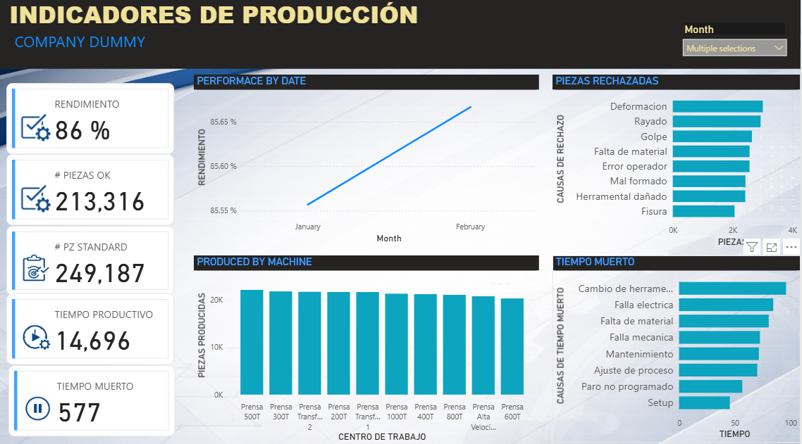

#  🚘 Dashboard de Indicadores de Producción (Manufactura Automotriz)

### Índice
* [INTRODUCCION](#introduccion)
* [INSTALACION](#instalacion)
* [HERRAMIENTAS](#herramientas)
* [APLICACIONES](#aplicaciones)
* [PORTAFOLIO](#portafolio)

## INTRODUCCION

Este proyecto presenta una solución de análisis de datos para un entorno de manufactura automotriz, enfocada en el monitoreo del desempeño operativo mediante indicadores clave como eficiencia por centro de trabajo; tiempo muerto y sus causas; tiempo muerto y sus causas y tendecia de producción.

  

<H3>Objetivo</h3>

   Brindar visibilidad del desempeño productivo e identificar pérdidas de eficiencia mediante el análisis de:

      ✔️    Producción por máquina  
      🚫⏳  Causas de tiempo muerto  
      🧱❌ Piezas rechazadas (scrap)  
      📈    Tendencias de rendimiento   
      

  Esto permite:

    ⭐ Reducir tiempos muertos
    ⭐ Mejorar la eficiencia operativa
    ⭐ Identificar causas raíz de defectos
    ⭐ Optimizar recursos productivos

## INSTALACION
1️⃣ Descargar proyecto pbip   
2️⃣ Ejecutar Query Model en SQL Server para la creación de la base de datos 
3️⃣ Validar modelo con la consulta Query Validate en SQL Server  
4️⃣ Abrir proyecto pbip en Power BI y actualizar  

## HERRAMIENTAS
<ul>
  <li>
   🥃 SQL Server
  </li>
  <li>
   📊 Power BI, Power Query, DAX
  </li>
</ul>
  
## APLICACIONES
Este tipo de solución puede aplicarse en: 
🔹 Plantas automotrices  
🔹 Líneas de producción  
🔹 Monitoreo de eficiencia operativa  
🔹 Proyectos de mejora continua  

## PORTAFOLIO

<h3>🥈 Valor como Ingeniero de Datos y Analista 🥈</h3>

Este proyecto demuestra:

Diseño de modelos de datos estructurados para manufactura
Transformación de datos en indicadores clave de negocio
Comprensión de métricas industriales (OEE, eficiencia, scrap)
Construcción de soluciones orientadas a análisis operativo
Habilidad para soportar decisiones basadas en datos

📍Nota Final

Proyecto desarrollado con datos simulados, diseñado para reflejar escenarios reales de la industria manufacturera y demostrar capacidades en análisis y modelado de datos.

